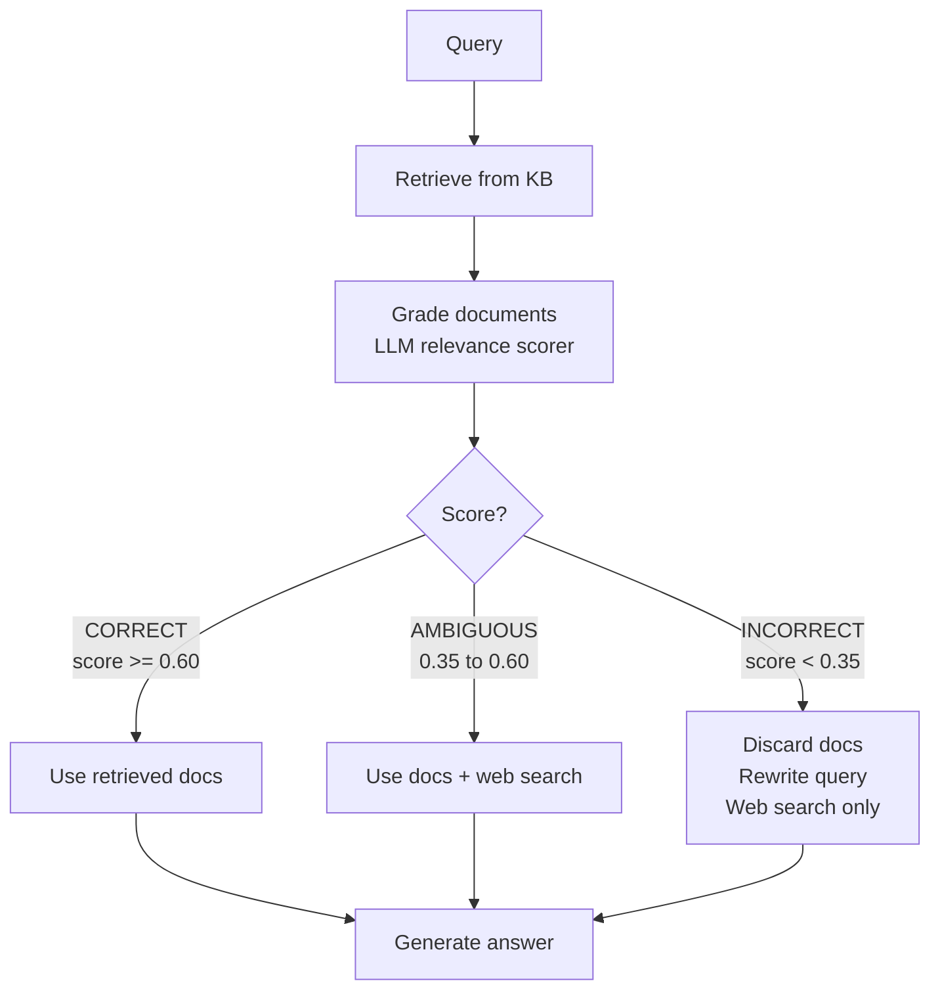

# Corrective RAG (CRAG)

## The Simple Idea (Feynman Explanation)

Standard RAG retrieves documents and passes them to the LLM regardless of quality. If the retriever returns irrelevant documents, the LLM either hallucinates or gives a wrong answer — silently.

CRAG makes retrieval failure visible and actionable. After retrieval, a grader scores the documents. Based on the score, the system takes one of three actions:

- **CORRECT** — documents are good → use them directly
- **AMBIGUOUS** — documents are partially relevant → use them but supplement with a web search
- **INCORRECT** — documents are irrelevant → discard them, rewrite the query, search the web

Think of it like a fact-checker who reviews the sources before handing them to the writer. If the sources are wrong, the fact-checker finds better ones before the writer starts.



---

## Algorithm



---

## Worked Example

**Query:** `"When did Marie Curie win the Nobel Prize in Chemistry?"` (in KB)
```
[GRADE] CORRECT (score=0.812)
[ACTION] Using retrieved docs
  - Marie Curie won the Nobel Prize in Chemistry in 1911.
  - Marie Curie won the Nobel Prize in Physics in 1903.
```

**Query:** `"What is the population of France?"` (not in KB)
```
[GRADE] INCORRECT (score=0.201)
[ACTION] Discarding docs. Rewritten: 'What is the population of France? overview'
  - [Web] General information about: What is the population of France? overview
```

**Query:** `"Tell me about Paris"` (partially in KB)
```
[GRADE] AMBIGUOUS (score=0.489)
[ACTION] Supplementing with web search
  - The Eiffel Tower is located in Paris and was built in 1889.
  - [Web] General information about: Tell me about Paris
```

---

## Key Findings

- **CRAG makes retrieval failure visible.** Instead of silently passing weak context to the LLM, it detects the failure and corrects course.
- **The two thresholds (LOWER, UPPER) control sensitivity.** A medical KB needs higher thresholds than a general FAQ. Tune per domain.
- **Query rewriting improves web search.** The original query may be too specific for a web search. Rewriting to a broader form ("overview", "explanation") improves web results.
- **Web search is a fallback, not a default.** CRAG only uses web search when the KB fails — it doesn't replace the KB.

---

## Pros, Cons & When to Use

| | |
|---|---|
| ✅ **Handles KB gaps** | Falls back to web search when the knowledge base doesn't have the answer. |
| ✅ **Visible failure mode** | Retrieval quality is graded and acted on, not silently ignored. |
| ❌ **Adds latency** | Grading + optional web search adds extra steps. |
| ❌ **Threshold tuning required** | Wrong thresholds cause over-correction (too many web searches) or under-correction (bad docs pass). |

**Suitable for:** Open-domain Q&A where the KB may not cover all queries — customer support, research assistants.

**Not suitable for:** Closed-domain systems where the KB is comprehensive and web search is not permitted (e.g., regulated industries).
