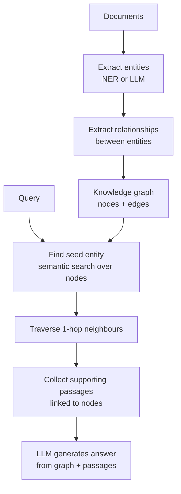

# GraphRAG

## The Simple Idea (Feynman Explanation)

Standard RAG retrieves text chunks. But chunks don't know about each other — a chunk about Marie Curie's prizes doesn't mention Pierre Curie unless they happen to be in the same paragraph.

GraphRAG adds a knowledge graph: entities (people, places, concepts) connected by relationships (won, married_to, discovered). When you ask a question, the system finds the relevant entity node and traverses its connections to retrieve richer, relationship-aware context.

Think of it like a Wikipedia page. The article about Marie Curie has links to Pierre Curie, radioactivity, and the Nobel Prize. GraphRAG follows those links.


---

## Algorithm



---

## Worked Example

**Graph triples:**
```
Marie Curie  --[won]-->        Nobel Prize Physics 1903
Marie Curie  --[won]-->        Nobel Prize Chemistry 1911
Marie Curie  --[married_to]--> Pierre Curie
Pierre Curie --[won]-->        Nobel Prize Physics 1903
```

**Query:** `"What prizes did Marie Curie win?"`
```
Seed entities: ['Marie Curie', 'Pierre Curie']
Graph context:
  Marie Curie --[won]--> Nobel Prize Physics 1903
  Marie Curie --[won]--> Nobel Prize Chemistry 1911
  Marie Curie --[married_to]--> Pierre Curie
  Marie Curie --[worked_at]--> University of Paris
Supporting passages:
  - Marie Curie was a physicist and chemist who conducted pioneering research...
  - Pierre Curie was a French physicist and Marie Curie's husband...
```

The graph surfaces Pierre Curie as a connected entity — a flat chunk retriever would miss this unless Pierre happened to be in the same chunk as the prizes.

---

## Key Findings

- **Relationships are first-class citizens.** GraphRAG retrieves not just facts but how things are connected — essential for questions about collaborations, networks, and dependencies.
- **Graph extraction quality controls everything.** Bad entity extraction → bad graph → bad retrieval.
- **1-hop traversal is usually sufficient.** 2+ hops can retrieve too much irrelevant context.
- **Graphs excel at entity-heavy corpora** — legal documents, research networks, organisational data.

---

## Pros, Cons & When to Use

| | |
|---|---|
| ✅ **Retrieves relationships** | Surfaces connections between entities that flat chunk retrieval misses. |
| ✅ **Multi-hop reasoning** | Can traverse the graph to combine multiple facts. |
| ❌ **Graph construction cost** | Entity and relationship extraction requires LLM calls per document. |
| ❌ **Quality dependency** | Extraction errors propagate to retrieval. |

**Suitable for:** Entity-heavy corpora — legal documents, research networks, organisational data, knowledge bases with explicit relationships.

**Not suitable for:** Narrative text where relationships are implicit and hard to extract reliably.
