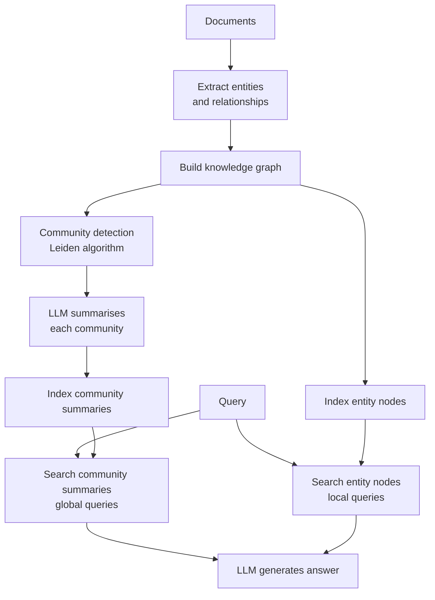

# Microsoft GraphRAG

## The Simple Idea (Feynman Explanation)

Basic GraphRAG retrieves individual entity nodes and their connections. But what if you ask a broad question like "What is this corpus about?" or "Summarise the main themes"? No single entity node can answer that — you need a view of the whole graph.

Microsoft GraphRAG solves this by detecting **communities** — clusters of closely related entities — and generating a **summary for each community**. These summaries answer global questions. Individual entity nodes answer local questions. Both are indexed and retrieved together.

Think of it like a city map. Individual streets (entities) answer "where is the bakery?". Neighbourhood summaries (communities) answer "what kind of area is this?". The city overview (root summary) answers "what is this city known for?".



---

## Algorithm



---

## Worked Example

**Communities detected:**
```
Community 0 (Curie-Becquerel): Marie Curie, Pierre Curie, Henri Becquerel,
                                 Radium, Polonium, Radioactivity
Community 1 (Python):           Python, Guido van Rossum, PyPI
```

**Community summaries:**
```
Community 0: "The Curie-Becquerel community covers radioactivity research.
              Marie Curie and Pierre Curie discovered radium and polonium.
              Henri Becquerel discovered radioactivity. All three shared
              the 1903 Nobel Prize in Physics."

Community 1: "The Python community covers the Python programming language.
              Python was created by Guido van Rossum and packages are
              distributed via PyPI."
```

**Query:** `"What did Marie Curie discover?"`
```
Community summary: The Curie-Becquerel community covers radioactivity research...
Local entities (6):
  - Marie Curie: physicist, chemist, Nobel laureate
  - Pierre Curie: physicist, Marie Curie's husband
  - Radium: radioactive element discovered by Marie Curie
```

---

## Local vs Global Queries

| Query type | Example | Retrieval source |
|---|---|---|
| Local | "When did Marie Curie win the Physics Nobel?" | Entity nodes |
| Global | "What are the main themes in this corpus?" | Community summaries |
| Mixed | "What did Marie Curie contribute to science?" | Both |

---

## Key Findings

- **Community summaries answer global queries** that no single entity or chunk can answer — "what is this corpus about?", "what are the main themes?".
- **Microsoft GraphRAG uses the Leiden algorithm** for community detection — a graph clustering algorithm that finds densely connected subgraphs.
- **Heavier than basic GraphRAG** — requires entity extraction, graph construction, community detection, and LLM summarisation per community.
- **Best for large, heterogeneous corpora** where users ask both specific and broad questions.

---

## Pros, Cons & When to Use

| | |
|---|---|
| ✅ **Global + local retrieval** | Community summaries answer broad questions; entity nodes answer specific ones. |
| ✅ **Corpus-level synthesis** | Can answer "what is this corpus about?" — impossible with flat chunk retrieval. |
| ❌ **Very high construction cost** | Entity extraction + graph + community detection + LLM summarisation per community. |
| ❌ **Static index** | Communities must be rebuilt when the corpus changes significantly. |

**Suitable for:** Large, heterogeneous corpora where users ask both specific and broad synthesis questions — research corpora, enterprise knowledge bases, large document collections.

**Not suitable for:** Small, focused corpora where basic GraphRAG or flat retrieval is sufficient.
