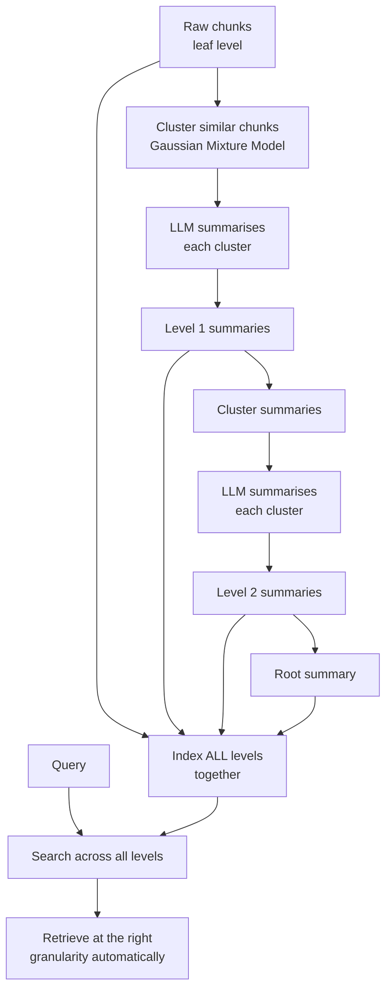

# RAPTOR

## The Simple Idea (Feynman Explanation)

Standard RAG indexes individual chunks. A specific question ("When did Marie Curie die?") retrieves the right chunk. But a broad question ("Give me an overview of Marie Curie") needs information from many chunks — no single chunk covers everything.

RAPTOR builds a tree of summaries. Raw chunks are the leaves. Similar chunks are clustered and summarised into parent nodes. Those summaries are clustered again into higher-level summaries. The tree is indexed at all levels simultaneously.

A specific question retrieves a leaf. A broad question retrieves a high-level summary. The retriever naturally selects the right level of granularity.

```
Level 2 (root):   [One summary of everything]
Level 1:          [Curie summary] [Python summary] [...]
Level 0 (leaves): [chunk1] [chunk2] [chunk3] [chunk4] [chunk5] ...
```


---

## Algorithm



---

## Worked Example

**10 leaf chunks** about Marie Curie and Python.

**After clustering and summarising:**
```
Tree built: 10 leaves → 3 L1 summaries → 1 root
Total indexed nodes: 14
```

**Query (specific):** `"When did Marie Curie die?"`
```
[L0, score=0.712] Marie Curie died in 1934 from aplastic anaemia...  ← leaf
[L0, score=0.634] Marie Curie was born in Warsaw, Poland in 1867.
[L1, score=0.521] [Summary of 3 chunks] Marie Curie was born...
```

**Query (broad):** `"Give me an overview of Marie Curie"`
```
[L2, score=0.689] [Summary of 3 chunks] [Summary of 3 chunks]...  ← root
[L1, score=0.634] [Summary of 3 chunks] Marie Curie was born...
[L0, score=0.589] Marie Curie won the Nobel Prize in Physics in 1903.
```

The specific query retrieves a leaf (exact fact). The broad query retrieves the root summary (synthesis). Same index, different granularity.

---

## Key Findings

- **Indexing all levels together is the key insight.** The retriever selects the right granularity automatically — no need to decide in advance which level to search.
- **Summary quality is critical.** Errors in L1 summaries propagate to L2. Use a strong LLM for summarisation.
- **Gaussian Mixture Models for soft clustering.** Unlike k-means (hard assignment), GMM allows a chunk to belong to multiple clusters with different probabilities — better for overlapping topics.
- **RAPTOR helps questions that need both detail and overview.** A question like "What were Marie Curie's main contributions?" needs both specific facts (leaf) and synthesis (higher level).

---

## Pros, Cons & When to Use

| | |
|---|---|
| ✅ **Multi-granularity retrieval** | Answers both specific and broad questions from the same index. |
| ✅ **Automatic level selection** | The retriever picks the right level — no manual routing needed. |
| ❌ **High construction cost** | Clustering + LLM summarisation at each level. |
| ❌ **Summary errors propagate** | A bad L1 summary produces a bad L2 summary. |

**Suitable for:** Large corpora where users ask both specific factual questions and broad synthesis questions — research papers, books, comprehensive reports.

**Not suitable for:** Small corpora or corpora where all queries are specific — the tree construction overhead is not justified.
