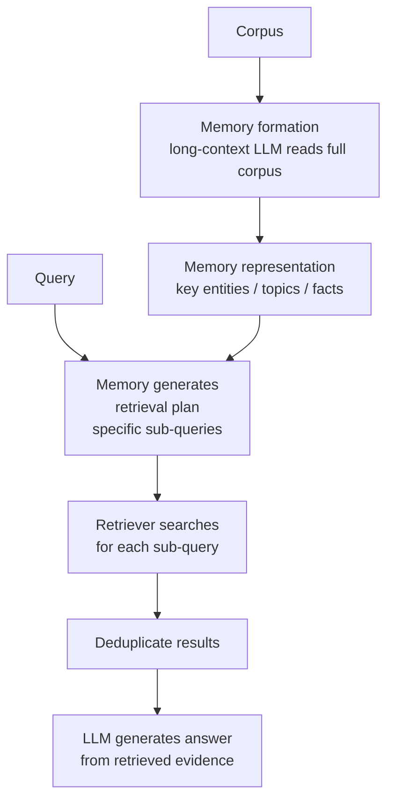

# MemoRAG

## The Simple Idea (Feynman Explanation)

Standard RAG searches the knowledge base directly from the user's query. But the query might use different vocabulary than the documents, or the user might not know exactly what to search for.

MemoRAG adds a memory layer that has already read the entire corpus. When a query arrives, the memory doesn't answer it — it generates **retrieval clues**: specific sub-queries or hints about where the relevant information lives. The retriever then uses these clues to find targeted evidence.

Think of it like asking a librarian who has read every book in the library. You ask "What caused Marie Curie's death?" The librarian says "Look for 'aplastic anaemia' and 'radiation exposure' — those are the key terms in the relevant section." You then search for those specific terms.

---

## Algorithm



---

## Worked Example

**Memory formed from 7 documents:**
```
Key topics: ['Curie', 'Marie', 'Nobel', 'Pierre', 'Prize']
```

**Query:** `"What caused Marie Curie's death?"`
```
[MEMORY PLAN] ["What caused Marie Curie's death?",
               "Marie Curie Marie",
               "Marie Curie Curie"]

[RETRIEVED] 4 unique docs:
  [0.812] Marie Curie died in 1934 from aplastic anaemia caused by radiation exposure.
  [0.689] Marie Curie was born in Warsaw, Poland in 1867.
  [0.634] Marie Curie won the Nobel Prize in Physics in 1903...
```

**Query:** `"Tell me about Nobel prizes"`
```
[MEMORY PLAN] ["Tell me about Nobel prizes",
               "Marie Curie Nobel",
               "Marie Curie Prize"]

[RETRIEVED] 4 unique docs:
  [0.823] Marie Curie won the Nobel Prize in Chemistry in 1911...
  [0.756] Marie Curie won the Nobel Prize in Physics in 1903...
  [0.689] Marie Curie is the only person to win Nobel Prizes in two different sciences.
```

The memory recognises "Nobel" and "Prize" as key corpus topics and generates targeted sub-queries that surface all three Nobel-related documents.

---

## Memory vs Standard RAG

| | Standard RAG | MemoRAG |
|---|---|---|
| Query processing | Embed query → search | Memory generates clues → targeted search |
| Vocabulary gap | Query must match doc vocabulary | Memory bridges the gap |
| Broad queries | May miss distributed information | Memory knows where to look |
| Cost | Low | Higher (memory formation + planning) |

---

## Key Findings

- **Memory bridges vocabulary gaps.** The memory knows the corpus vocabulary and generates sub-queries using the right terms, even when the user's query uses different words.
- **Memory formation is a one-time cost.** The long-context LLM reads the corpus once. After that, memory-guided retrieval is fast.
- **Memory can become stale.** If the corpus changes significantly, the memory must be rebuilt.
- **In production, the memory is a long-context LLM** (e.g., Gemini 1.5 Pro with 1M token context) that has read the full corpus and can generate rich, specific retrieval clues.

---

## Pros, Cons & When to Use

| | |
|---|---|
| ✅ **Bridges vocabulary gaps** | Memory generates sub-queries using corpus vocabulary, not just user vocabulary. |
| ✅ **Better broad query handling** | Memory knows where relevant information lives across the corpus. |
| ❌ **Memory formation cost** | One long-context LLM call to read the full corpus. |
| ❌ **Memory staleness** | Must be rebuilt when the corpus changes. |

**Suitable for:** Large corpora where users ask broad questions or use different vocabulary than the documents — research corpora, enterprise knowledge bases.

**Not suitable for:** Small corpora or real-time indexing where memory formation overhead is not justified.
