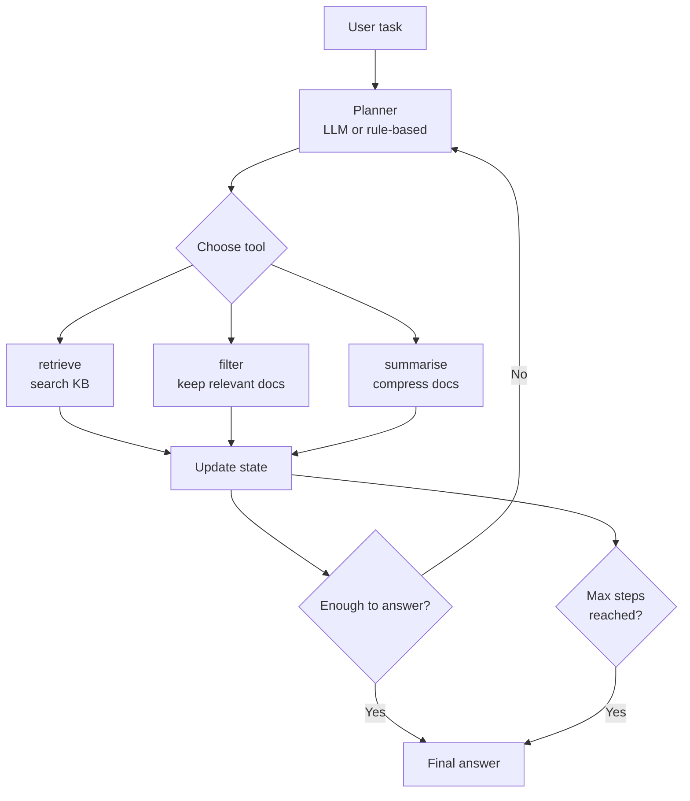

# Agentic RAG

## The Simple Idea (Feynman Explanation)

Standard RAG has a fixed pipeline: retrieve → generate. It always does the same steps in the same order. But complex tasks need flexibility — sometimes you need to retrieve, then filter, then summarise. Sometimes you need to retrieve twice. Sometimes you need to check if the first retrieval was good enough before proceeding.

Agentic RAG gives an agent a set of tools and lets it decide which tool to use next based on the current state of the task. The agent keeps acting until it has enough information to answer — or until a safety limit stops it.

Think of it like a research assistant who can search the library, filter results, summarise findings, and decide when they have enough to write the report — rather than always doing the same fixed steps.

---

## Algorithm



---

## Worked Example

**Task:** `"What Nobel Prizes did Marie Curie win?"`

```
[Step 1] retrieve
  [0.812] Marie Curie won the Nobel Prize in Chemistry in 1911.
  [0.756] Marie Curie won the Nobel Prize in Physics in 1903.
  [0.689] Marie Curie is the only person to win Nobel Prizes in two different sciences.
  [0.534] Marie Curie was born in Warsaw, Poland in 1867.

[Step 2] filter  (remove off-topic docs)
  → 3 docs after filter

[Step 3] summarise
  → Marie Curie won the Nobel Prize in Chemistry in 1911. | Marie Curie won the Nobel...

[Step 4] ANSWER
```

**Task:** `"Tell me about Python"`

```
[Step 1] retrieve
  [0.712] Python is a high-level programming language known for readability.
  [0.689] Python was created by Guido van Rossum and first released in 1991.
  [0.534] Marie Curie was born in Warsaw, Poland in 1867.  ← off-topic
  [0.421] Marie Curie won the Nobel Prize in Physics in 1903.  ← off-topic

[Step 2] filter  (remove Marie Curie docs)
  → 2 docs after filter

[Step 3] summarise → [Step 4] ANSWER
```

The filter step removes off-topic documents that appeared in the initial retrieval — something a fixed pipeline cannot do.

---

## Tool Design

| Tool | Purpose | When to use |
|---|---|---|
| `retrieve(query)` | Search the knowledge base | Always first |
| `filter(docs, topic)` | Remove off-topic documents | When initial retrieval is noisy |
| `summarise(docs)` | Compress multiple docs | Before answering broad questions |
| `web_search(query)` | Search the web | When KB is insufficient |
| `evaluate(answer)` | Check answer quality | Before returning to user |

---

## Key Findings

- **`max_steps` is a required safety guardrail.** Without it, a bad planner can loop forever. 3–5 steps is usually sufficient.
- **The planner is the core design problem.** A rule-based planner (as in the code) is predictable but brittle. An LLM planner is flexible but can make unexpected tool choices.
- **Tool design matters as much as the agent loop.** Well-designed tools with clear, narrow responsibilities make the planner's job easier.
- **Agentic RAG is overkill for simple queries.** Use standard RAG for straightforward Q&A. Reserve agentic RAG for tasks with uncertain retrieval paths.

---

## Pros, Cons & When to Use

| | |
|---|---|
| ✅ **Flexible pipeline** | Adapts the retrieval strategy to the task, not a fixed sequence. |
| ✅ **Handles complex tasks** | Can retrieve, filter, summarise, and evaluate in any order. |
| ❌ **Unpredictable** | An LLM planner may choose unexpected tool sequences. |
| ❌ **Harder to debug** | Variable execution paths make failures harder to trace. |
| ❌ **Requires guardrails** | Must cap iterations and validate tool outputs. |

**Suitable for:** Complex tasks with uncertain retrieval paths — research assistants, multi-step question answering, tasks that require combining multiple retrieval strategies.

**Not suitable for:** Simple Q&A where a fixed pipeline is sufficient and predictability matters more than flexibility.
