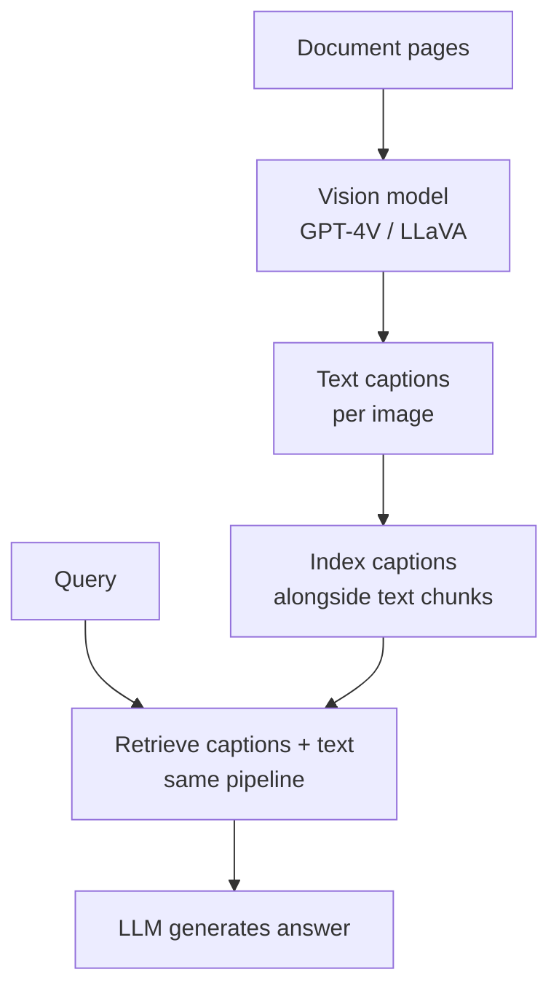
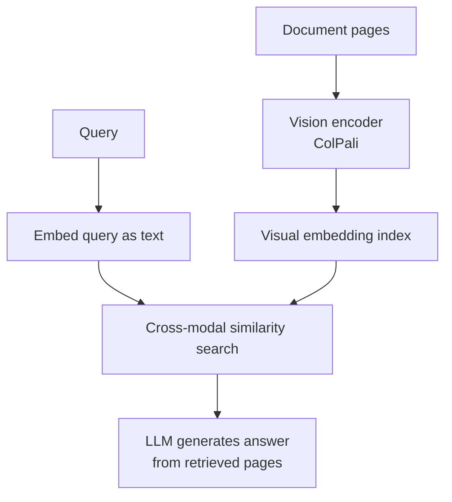

# Multimodal RAG

## The Simple Idea (Feynman Explanation)

Standard RAG only retrieves text. But real documents — annual reports, research papers, presentations — contain charts, tables, and diagrams that carry critical information. A bar chart showing quarterly revenue cannot be retrieved by a text-only system.

Multimodal RAG extends retrieval to non-text content. The most common approach is **captioning**: a vision model reads each image and writes a text description. That description is indexed and retrieved exactly like any other text chunk. The retriever doesn't need to know whether content came from text or an image.

```
Page 4 of annual report:
  Chart: Bar chart showing Q1=$12.4B, Q2=$12.8B, Q3=$12.9B, Q4=$13.1B

Vision model caption:
  "Bar chart showing Nike revenue by quarter: Q1=$12.4B, Q2=$12.8B..."

→ Caption indexed alongside text chunks
→ Query "quarterly revenue breakdown" retrieves the caption
```




---

## Two Patterns

### Pattern 1 — Captioning



### Pattern 2 — Vision Embeddings (ColPali)



---

## Worked Example

**Corpus:** Nike 2023 Annual Report (text + 4 image captions)

**Query:** `"What was Nike's quarterly revenue breakdown?"`
```
[0.774] [text ] Nike's revenue in fiscal 2023 was $51.2 billion...
[0.712] [image] Bar chart showing Nike revenue by quarter: Q1=$12.4B...
                Source: page_4_chart.png
```

**Query:** `"Where does Nike manufacture its products?"`
```
[0.891] [image] World map showing Nike manufacturing locations: Vietnam 50%...
                Source: page_15_supply_chain.png
[0.423] [text ] Nike employs approximately 79,000 people worldwide.
```

The manufacturing query retrieves only the world map image — this data exists entirely in the visual and would be missed by text-only RAG.

---

## Captioning vs Vision Embeddings

| | Captioning | ColPali |
|---|---|---|
| Retrieval | Text similarity on captions | Cross-modal similarity on page images |
| Inspectable | ✅ Caption is readable | ❌ Vector is opaque |
| Layout preservation | Partial | ✅ Full page layout |
| Cost | One vision call per image | Embedding only |

---

## Key Findings

- **Charts and tables are invisible to text-only RAG.** The quarterly revenue breakdown exists only in the bar chart — no text chunk contains it.
- **Captions must be detailed.** "Bar chart about revenue" is useless. "Q1=$12.4B, Q2=$12.8B..." is retrievable.
- **Always store the source image path.** When the LLM cites a chart, the user needs to verify it against the original figure.
- **ColPali embeds entire page images** — preserves layout, tables, and visual structure that captioning may miss.

---

## Pros, Cons & When to Use

| | |
|---|---|
| ✅ **Retrieves visual information** | Charts, tables, diagrams, and maps are now searchable. |
| ✅ **Transparent (captioning)** | Captions are readable and auditable. |
| ❌ **Vision model cost** | One inference per image at indexing time. |
| ❌ **Caption quality dependency** | Poor captions produce poor retrieval. |

**Suitable for:** PDFs, annual reports, research papers, presentations, manuals — any document where critical information is in charts, tables, or diagrams.

**Not suitable for:** Plain text corpora with no visual content — vision model overhead adds cost with no benefit.
