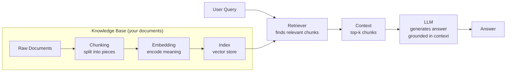
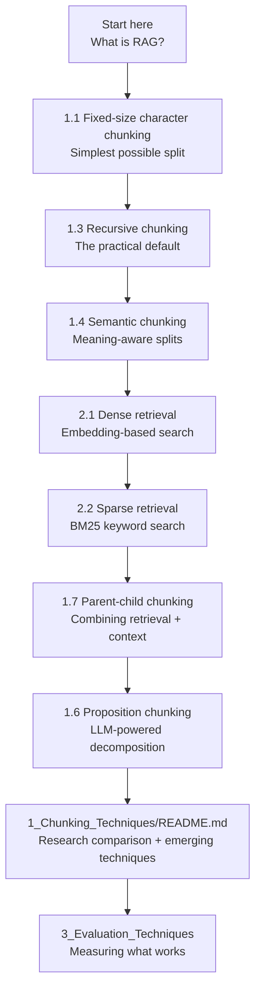

# Explore RAG Techniques

A hands-on learning repository for **Retrieval-Augmented Generation (RAG)** — from the fundamentals to cutting-edge research. Every technique is implemented in Python with a detailed README covering the logic, step-by-step walkthrough, Feynman explanation, Mermaid diagrams, pros/cons, and best use cases.

The repository is structured to follow the natural learning progression: understand how to prepare data (chunking), how to find it (retrieval), and how to measure if it worked (evaluation). Numbers prefix every folder and file so the order of study is always clear.

> This repository is actively maintained. New techniques and research papers are added regularly as the field evolves.

---

## What is RAG?

A standard LLM is frozen at its training cutoff — it cannot access your private documents, your company's knowledge base, or last week's news. RAG fixes this by adding a retrieval step before generation:



The quality of the final answer depends on three things:
1. **How well the document was chunked** — did the split preserve meaning?
2. **How well the retriever finds relevant chunks** — did the right pieces come back?
3. **How well the system is evaluated** — do we know if it's actually working?

This repository covers all three, in order.

---

## Repository Structure

```
explore-rag-techniques/
│
├── 1_Chunking_Techniques/          ← How to split documents
│   ├── README.md                   ← Overview + research comparison
│   ├── 1_fixed_size_chunking_by_charecter/
│   ├── 2_fixed_size_chunking_by_token/
│   ├── 3_recursive_chunking/
│   ├── 4_semantic_chunking/
│   ├── 5_structured_document_chunking/   ← Markdown, JSON, HTML, Code
│   ├── 6_proportion_or_agentic_chunking/
│   └── 7_hierarchical_or_parent-child_chunking/
│
├── 2_Retrieval_Techniques/         ← How to find relevant chunks
│   ├── 1_dense_retrieval/          ← FAISS + sentence embeddings
│   └── 2_sparse_retrieval/         ← BM25 exact-match
│
├── 3_Evaluation_Techniques/        ← How to measure RAG quality
│   └── (coming soon)
│
└── pyproject.toml                  ← All dependencies (managed with uv)
```

---

## Module 1 — Chunking Techniques

How you split a document determines what the retriever can find. A chunk that cuts a sentence in half loses meaning. A chunk that is too large dilutes the signal. This module covers every major splitting strategy from simplest to most sophisticated.

| # | Technique | Core idea | Best for |
|---|---|---|---|
| 1 | Fixed-size by character | Count characters, cut | Prototypes, structured logs |
| 2 | Fixed-size by token | Count tokens (model-aware) | LLM context window control |
| 3 | Recursive character | Paragraph → line → word → char | General natural language |
| 4 | Semantic | Split at embedding similarity drops | Topic-rich documents |
| 5 | Structured (MD/HTML/JSON/Code) | Split at format boundaries | Formatted documents |
| 6 | Proposition / Agentic | LLM rewrites as atomic facts | High-precision factual Q&A |
| 7 | Parent-Child (Hierarchical) | Search small, return large | Context-rich retrieval |

The folder-level [README](1_Chunking_Techniques/README.md) also covers three emerging techniques from 2025 research — Late Chunking, Contextual Retrieval, and Vision-Guided Chunking — with full performance comparisons from three papers.

---

## Module 2 — Retrieval Techniques

Once documents are chunked and indexed, the retriever finds the most relevant pieces for a given query. Different retrieval strategies have different strengths.

| # | Technique | Mechanism | Best for |
|---|---|---|---|
| 1 | Dense retrieval | Cosine similarity in embedding space | Semantic Q&A, paraphrase matching |
| 2 | Sparse retrieval | BM25 term frequency scoring | Exact terms, error codes, IDs |

Hybrid retrieval (combining both) is covered in the chunking README's research section.

---

## Module 3 — Evaluation Techniques

*(Coming soon)*

Knowing whether your RAG system works requires more than eyeballing answers. This module will cover:
- Faithfulness — does the answer contradict the retrieved context?
- Answer relevance — does the answer address the question?
- Context precision / recall — did the retriever find the right chunks?
- Frameworks: RAGAS, TruLens, DeepEval

---

## How Each Technique is Documented

Every technique folder contains:

- `N_technique_name.py` — minimal, runnable implementation with real output in comments
- `README.md` — full documentation including:
  - **Feynman explanation** — the idea explained simply, without jargon
  - **Step-by-step algorithm** — how it actually works internally
  - **Worked example** — real input → real output traced through the algorithm
  - **Mermaid diagrams** — visual flowcharts of the pipeline
  - **Pros, cons & when to use** — honest trade-offs and best/worst use cases
  - **Key findings** — non-obvious behaviours discovered from the implementation

---

## Setup

This project uses [uv](https://docs.astral.sh/uv/) for dependency management.

```bash
# Install dependencies
uv sync

# Run any technique
uv run python 1_Chunking_Techniques/3_recursive_chunking/1_recursive_chunking.py
```

Techniques that require API keys (proposition chunking) need a `.env` file in their folder:
```
OPENAI_API_KEY=sk-...
```

---

## Learning Path

If you are new to RAG, follow the numbers:



---

## Tech Stack

| Library | Purpose |
|---|---|
| `sentence-transformers` | Local embedding models |
| `faiss` | Vector similarity search |
| `rank_bm25` | BM25 sparse retrieval |
| `langchain-text-splitters` | Chunking utilities |
| `langchain-experimental` | Semantic chunker |
| `langchain-classic` | Parent document retriever |
| `langchain-chroma` | Chroma vector store |
| `transformers` | HuggingFace tokenizers |
| `tiktoken` | OpenAI tokenizer |
| `openai` | Proposition chunking (GPT-4o-mini) |
| `bs4` | HTML parsing for structured chunking |
