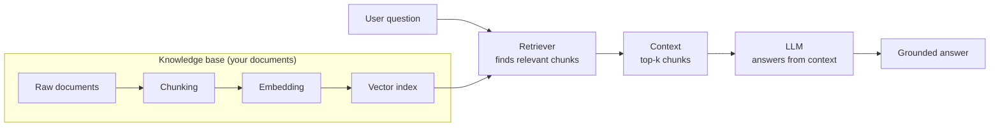
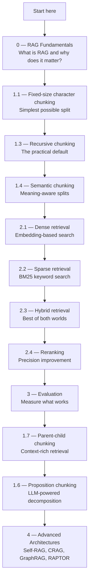

# 🔍 Explore RAG Techniques

<div align="center">


*Every technique implemented in Python · Every concept explained simply · Continuously updated*


[](https://github.com/mdhasnainali/explore-rag-techniques/commits/main)
[](LICENSE)
[](CONTRIBUTING.md)
[](https://github.com/mdhasnainali/explore-rag-techniques/stargazers)

</div>


A practical, continuously updated learning resource covering every layer of Retrieval-Augmented Generation — from how to split a document to how to evaluate whether your system actually works. Each technique comes with runnable Python code, a Feynman-style explanation, step-by-step algorithm breakdown, Mermaid diagrams, worked examples, and honest pros/cons.

**New here?** Start with [What is RAG?](#-what-is-rag) → follow the [Learning Path](#-learning-path) → run your first example in under 2 minutes.


## 📚 Quick Navigation

| I want to... | Start here |
|---|---|
| **Understand what RAG is** | [RAG Fundamentals](0_RAG_Fundamentals/README.md) |
| **Learn how to split documents** | [Chunking Techniques](1_Chunking_Techniques/README.md) |
| **Compare all chunking strategies** | [Chunking Research & Comparison](1_Chunking_Techniques/README.md#comparative-performance-analysis) |
| **Learn dense retrieval (FAISS + embeddings)** | [Dense Retrieval](2_Retrieval_Techniques/1_dense_retrieval/README.md) |
| **Learn sparse retrieval (BM25)** | [Sparse Retrieval](2_Retrieval_Techniques/2_sparse_retrieval/README.md) |
| **Combine dense + sparse** | [Hybrid Retrieval](2_Retrieval_Techniques/3_hybrid_retrieval/README.md) |
| **Improve retrieval precision** | [Reranking](2_Retrieval_Techniques/4_reranking/README.md) |
| **Handle multi-part questions** | [Multi-Query Retrieval](2_Retrieval_Techniques/5_multi-query_retrieval/README.md) |
| **Measure if my RAG works** | [Evaluation Techniques](3_Evaluation_Techniques/README.md) |
| **Go beyond basic RAG** | [Advanced RAG Architectures](4_Advanced_RAG_Architectures/README.md) |
| **Understand Self-RAG / CRAG** | [Self-RAG](4_Advanced_RAG_Architectures/1_self_rag/README.md) · [Corrective RAG](4_Advanced_RAG_Architectures/2_corrective_rag/README.md) |
| **Build a knowledge graph RAG** | [GraphRAG](4_Advanced_RAG_Architectures/3_graph_rag/README.md) · [Microsoft GraphRAG](4_Advanced_RAG_Architectures/4_microsoft_graphrag/README.md) |
| **Contribute a new technique** | [Contributing Guide](CONTRIBUTING.md) |

---

## 🔍 What Is RAG?

A standard LLM answers from what it memorised during training. It cannot access your private documents, your company's knowledge base, or anything that happened after its training cutoff.

RAG gives the LLM a filing cabinet. Before answering, it looks up the relevant files, reads them, and answers based on what it just read — not just what it memorised.



The quality of the final answer depends on four decisions:

1. **How the document was chunked** — did the split preserve meaning?
2. **How the retriever finds relevant chunks** — did the right pieces come back?
3. **How the LLM uses the context** — did it stay grounded?
4. **How the system is evaluated** — do you know if it's actually working?

This repository covers all four, in order.

---

## 🎯 Learning Path

Follow the numbers if you are new to RAG:



| Module | Focus | Outcome |
|---|---|---|
| `0_RAG_Fundamentals` | Simple RAG, Reliable RAG | Understand the basic pipeline and failure modes |
| `1_Chunking_Techniques` | 9 splitting strategies + research comparison | Know how chunk boundaries affect retrieval quality |
| `2_Retrieval_Techniques` | 15 retrieval strategies | Know how different retrievers win in different scenarios |
| `3_Evaluation_Techniques` | 6 metrics + framework overview | Measure faithfulness, relevance, precision, and recall |
| `4_Advanced_RAG_Architectures` | Self-RAG, CRAG, GraphRAG, RAPTOR, MemoRAG, Agentic, Multimodal | Understand larger system patterns beyond a single retriever |

---

## 📖 What Every Technique Includes

Every technique folder contains:

- **`N_technique_name.py`** — minimal, runnable implementation with real output in comments
- **`README.md`** — full documentation:

| Section | What it covers |
|---|---|
| Feynman Explanation | The idea explained simply, with a concrete analogy — no jargon |
| Algorithm | Step-by-step breakdown of how it works internally |
| Worked Example | Real input → real output traced through the algorithm |
| Mermaid Diagram(s) | Visual flowcharts of the pipeline |
| Key Findings | Non-obvious behaviours discovered from running the code |
| Pros, Cons & When to Use | Honest trade-offs, best use cases, and when to avoid it |

---

## 🔬 Research Coverage

The [Chunking Techniques README](1_Chunking_Techniques/README.md) includes performance comparisons from four papers:

| Paper | Key finding |
|---|---|
| *Vision-Guided Chunking Is All You Need* — Tripathi et al. (2025) · [arXiv:2506.16035](https://arxiv.org/abs/2506.16035) | Vision-guided chunking: **+14% accuracy** over vanilla RAG on complex PDFs |
| *Reconstructing Context* — Merola & Singh (2025) · [arXiv:2504.19754](https://arxiv.org/abs/2504.19754) | Contextual RankFusion beats late chunking; chunking method matters less than retrieval method |
| *RAG for Service Discovery* — Pesl et al. (2025) · [arXiv:2505.19310](https://arxiv.org/abs/2505.19310) | Domain-specific chunking (endpoint-based) outperforms all generic strategies for API docs |
| *Adaptive Chunking* — de Moura Júnior et al. (2026) · [arXiv:2603.25333](https://arxiv.org/abs/2603.25333) | Metric-guided adaptive selection raises answer correctness from 62–64% to **72%** (+33% questions answered) |

Three emerging techniques documented in their own folders (not yet implemented):
- **[Late Chunking](1_Chunking_Techniques/10_late_chunking/README.md)** — embed the whole document first, segment token embeddings after
- **[Contextual Retrieval (ContextualRankFusion)](1_Chunking_Techniques/11_contextual_retrieval/README.md)** — LLM-generated context + BM25 hybrid + reranking
- **[Vision-Guided Chunking](1_Chunking_Techniques/12_vision_guided_chunking/README.md)** — multimodal LMM reads PDF as images, generates structured chunks

---

## ⚡ Setup

This project uses [uv](https://docs.astral.sh/uv/) for dependency management.

```bash
# Clone
git clone https://github.com/mdhasnainali/explore-rag-techniques.git
cd explore-rag-techniques

# Install all dependencies
uv sync

# Run any technique
uv run python 1_Chunking_Techniques/3_recursive_chunking/1_recursive_chunking.py
uv run python 2_Retrieval_Techniques/3_hybrid_retrieval/1_hybrid_retrieval.py
uv run python 3_Evaluation_Techniques/1_evaluation_metrics.py
```

Techniques that require an API key (proposition chunking) need a `.env` file:
```
OPENAI_API_KEY=sk-...
```

All other techniques run **fully offline** — no API key needed.

---

## 🤝 Contributing

Found an error? Have a technique to add? PRs are welcome.

See [CONTRIBUTING.md](CONTRIBUTING.md) for the full guide. The short version:

1. Fork → branch → implement → run the code → capture real output
2. Follow the README structure in [AGENTS.md](AGENTS.md)
3. Open a PR with the real output pasted in the description

---

## 🔄 Living Repository

This repository is actively maintained. New techniques and research papers are added regularly as the field evolves.

**⭐ Star and Watch** to get notified when updates are pushed.

---

## 📄 License

[MIT License](./LICENSE) — free to use, share, and build on.

---

<p align="center">
  <b>Built and maintained by <a href="https://www.linkedin.com/in/mdhasnainali/">Md. Hasnain Ali</a></b><br/>
  <a href="mailto:mdhasnainali.01@gmail.com"></a>
  <a href="https://www.linkedin.com/in/mdhasnainali/"></a>
  <a href="https://github.com/mdhasnainali/explore-rag-techniques"></a>
</p>
